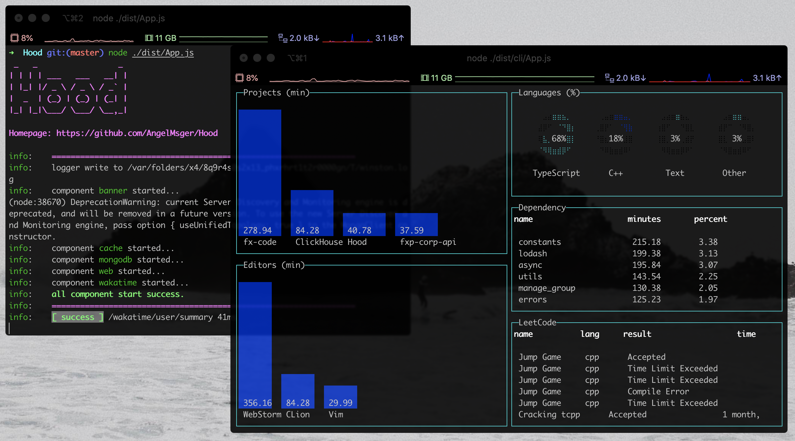
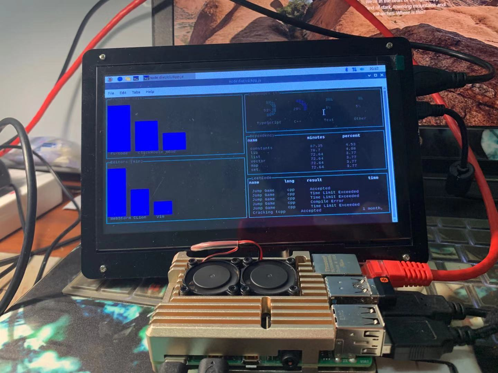

# Hood

## Overview
*Deprecated Project*.

Simple demo to track your workload and visualize it on [Respberry Pi](https://www.raspberrypi.org/).

## Description
I got a Pi from [my friend](https://github.com/FelixLee1995) and flush it with [Arch Linux Arm](https://archlinuxarm.org/). At the beginning, I just wanted to do some work from the CLI so no [DE](https://wiki.archlinux.org/index.php/Desktop_environment) installed.

I initialized this project to simply collect data from [Wakatime](https://wakatime.com/), [LeetCode](https://leetcode.com/), and then visualize my daily workload in **tty**.

However, soon, for some reason, I **gave up this solution** and turned to [Respbian](https://www.raspbian.org/). So **this project is meaningless now and archived**.




# Deploy

```bash
git clone https://github.com/AngelMsger/Hood.git
cd Hood

# option 1: for manual
# sudo systemctl start mongodb
# sudo systemctl start redis
export WAKATIME_USERNAME=...
export WAKATIME_SECRET_KEY=...
npm i && npm run build
node run start

# option 2: for docker
# customize docker-compose.yml
npm i && npm run build
docker-compose up -d
```

# License

[MIT](./LICENSE).
